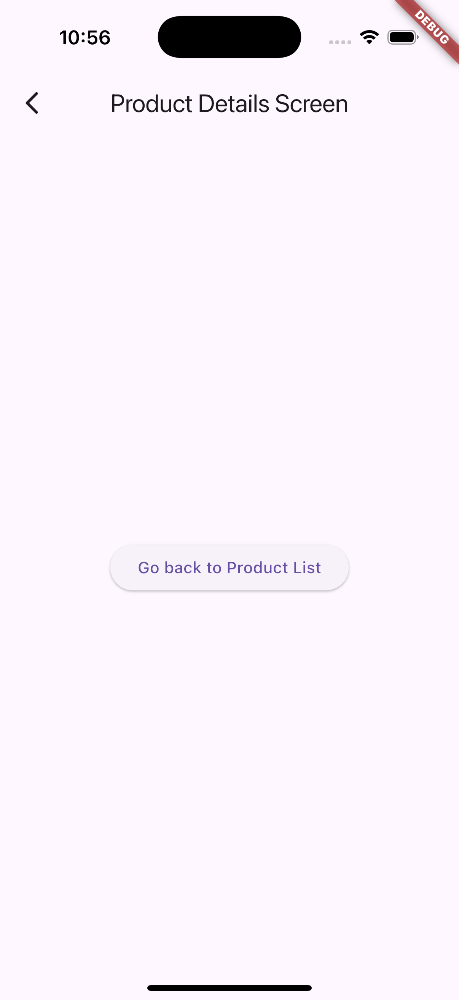

# app_toggle

Simple flutter app with hardcoded data to display a list of products some available and other not available.   The use of a toggle on the appbar to filter the display to show availability.   Also selecting a item brings up a Details page using a simple navigation for quick app building.    

The idea is to show the quickness to produce a few pages with filtering.

## Getting Started

###  Product  List Toggle off

###  Product Details - Nav

###  Toggle Filter Available List

